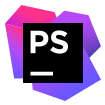

<h3 align="center">
  Вітаю, мене звати Євген!
  
</h3>

## Java Developer!

- 😎 Вивчаю программування як хобі та саморозвиток
- 📍 Я з України! 🇺🇦
- 💻 Активно вивчаю `Java` и `Angular Cli`
- 👨‍💻 Та хочу працювати `Java` Developer також робити круті проекти з `Angular`!

## Мови програмування, фреймворки та бібліотеки:

    
    
    
    
    
    

#### Фреймворки, бібліотеки та інше:

    
    
    
    
    
    
    
    
    
    
    
    
    
    
    
    
    

#### Контроль версій та автоматизація збірки:

    
    
    
    
    
    

#### 🗄️ Databases:

    
    
    
    

#### Методології та управління проектами:

 - __Scrum__
 - __Agile__

## Інструменти та середовища розробки:

#### Інструменти тестування та аналізу:

     
     
     
     
     

#### IDE та редактори:

      
     
     
     
     
     
     
     

#### Бази даних та візуалізація:

    
    
    

#### Інше:

### 🤝 Мои контакты:

    
    
    
    

### ⚙️ GitHub Analytics

  
  
  

    

    

    

    

#### 👨‍💻 CodeWars

    

#### 📝 StackOverflow

    

